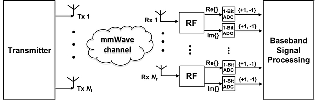

<!--
Copyright (C) 2018,2023 Mitsubishi Electric Research Laboratories (MERL)

SPDX-License-Identifier: AGPL-3.0-or-later
-->

# Angular-Domain mmWave Channel Estimation with 1-bit ADC: Cramer-Rao Bound
Code to compute one-bit CRB for estimating angular-domain channel parameters for massive MIMO.




## Features

Massive multiple-input multiple-output (MIMO) systems can significantly increase the spectral efficiency, mitigate propagation loss by exploiting large array gain, and reduce inter-user interference with high-resolution spatial beamforming. To reduce complexity and power consumption, several transceiver architectures have been proposed for mmWave massive MIMO systems: 1) an analog architecture, 2) a hybrid analog/digital architecture, and 3) a fully digital architecture with low-resolution ADCs.

To this end, we derive the Cramer-Rao bound (CRB) on estimating angular-domain channel parameters including angles-of-departure (AoDs), angles-of-arrival (AoAs), and associated channel path gains. Our analysis provides a simple tool to compare channel estimation performance among different one-bit quantization schemes. We also introduce a time-varying threshold scheme to one-bit ADCs to remove an ambiguity between the channel path gain and noise variance for the popular fixed zero-threshold scheme.

## Installation

MATLAB 2016 or above.

## Usage/Testing

Run mmWave_channelEst_angularDomain_1bit_CRBvsSNR.m

## Citation

If you use the software, please cite the following:

```BibTeX
@inproceedings{1bitCRB
    author = {Wang, Pu and Li, Jian and Pajovic, Milutin and Boufounos, Petros T. and Orlik, Philip V.},
    title = {On angular-domain channel estimation for one-bit massive {MIMO} systems with fixed and time-varying thresholds},
    booktitle = {2017 51st Asilomar Conference on Signals, Systems, and Computers},
    year = 2017,
    pages = {1056-1060},
    doi = {10.1109/ACSSC.2017.8335511},
    url = {https://www.merl.com/publications/docs/TR2017-187.pdf}
}
```

## Contact

Pu (Perry) Wang: pwang@merl.com

## Contributing

See [CONTRIBUTING.md](CONTRIBUTING.md) for our policy on contributions.

## License

Released under `AGPL-3.0-or-later` license, as found in the [LICENSE.md](LICENSE.md) file.

All files:

```
Copyright (C) 2018,2023 Mitsubishi Electric Research Laboratories (MERL).

SPDX-License-Identifier: AGPL-3.0-or-later
```
